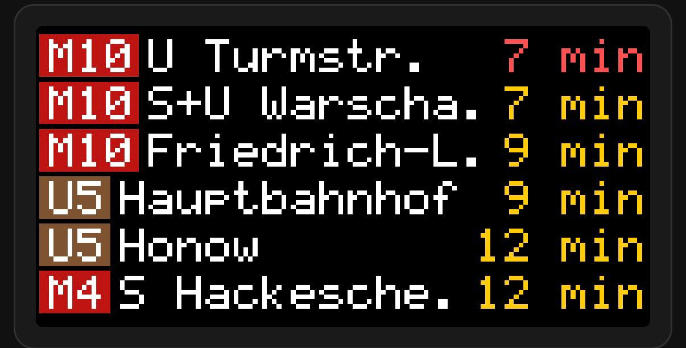

# BVG Departure Display for Home Assistant

[](https://github.com/hacs/integration)

A custom Home Assistant integration that shows real-time Berlin public transport (BVG/VBB) departures — complete with a pixel-art LED matrix Lovelace card.



## Features

- **Real-time departures** from any BVG/VBB station
- **Custom Lovelace card** with authentic LED matrix panel look
- **UI config flow** — add stations via Settings > Integrations
- **Transport filters** — show/hide S-Bahn, U-Bahn, Tram, Bus, Ferry, IC/ICE, Regional
- **Configurable departure count** (1, 3, 6, 9, 12, 15)
- **Auto-scrolling** through departures
- **Color-coded lines** by transport type
- **Delay indicators** — green (on time), orange (delayed), red (cancelled)
- **Options flow** — reconfigure filters and count without removing the integration

## Installation

### HACS (Recommended)

1. Open HACS in Home Assistant
2. Click the three dots menu → **Custom repositories**
3. Add this repository URL: `https://github.com/jako-dev/homeassistant-bvg-display`
4. Category: **Integration**
5. Click **Add** → find "BVG Departure Display" → **Download**
6. Restart Home Assistant

### Manual

1. Copy the `custom_components/bvg_display` folder into your `config/custom_components/` directory
2. Restart Home Assistant

## Setup

1. Go to **Settings → Devices & Services → Add Integration**
2. Search for **"BVG Departure Display"**
3. Enter a station name (e.g. "Alexanderplatz")
4. Select your station from the results
5. Configure departure count and transport filters
6. Done! Two sensor entities are created per station.

## Entities

Each station creates two sensors:

| Entity | Description |
|--------|-------------|
| `sensor.bvg_<station>_next` | Next departure as human-readable text |
| `sensor.bvg_<station>_departures` | All departures with full details in attributes |

### Attributes of `*_departures` sensor

```yaml
station_name: "S+U Alexanderplatz"
departures:
  - line: "U2"
    direction: "Pankow"
    product: "subway"
    delay: 0
    platform: "1"
    cancelled: false
    minutes: 2
  - line: "S7"
    direction: "Ahrensfelde"
    product: "suburban"
    delay: 60
    platform: "3"
    cancelled: false
    minutes: 5
```

## Lovelace Card

### Register the card resource

After installing the integration, add the card resource:

**Settings → Dashboards → Resources → Add Resource:**

```
URL: /bvg-display/bvg-display-card.js
Type: JavaScript Module
```

### Add the card to a dashboard

```yaml
type: custom:bvg-display-card
entity: sensor.bvg_s_u_alexanderplatz_departures
rows: 3
scroll_speed: 3000
```

### Card Options

| Option | Default | Description |
|--------|---------|-------------|
| `entity` | (required) | The `*_departures` sensor entity ID |
| `rows` | `4` | Number of departure rows to display (1–4) |
| `scroll_speed` | `3000` | Auto-scroll interval in milliseconds |

## Options / Reconfiguration

To change filters or departure count after setup:

1. Go to **Settings → Devices & Services**
2. Find **BVG Departure Display**
3. Click **Configure** on the station entry
4. Adjust settings and save

## API

Uses the public [v6.bvg.transport.rest](https://v6.bvg.transport.rest/) API:
- No API key required
- Rate limit: 100 requests/minute
- Polling interval: 30 seconds (respects HA update coordinator)

## Troubleshooting

| Problem | Solution |
|---------|----------|
| No departures shown | BVG API may be temporarily down (503). Check sensor state. |
| Card not rendering | Make sure you added the resource URL in dashboard settings |
| Entity unavailable | Check HA logs for API errors; verify internet connectivity |
| Stale data | The coordinator polls every 30s. Check `last_updated` on the entity |

## License

MIT
