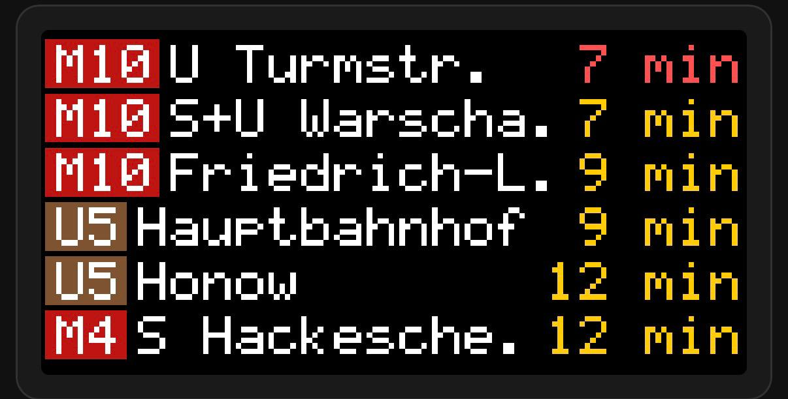

# BVG Departure Display for Home Assistant

[](https://github.com/hacs/integration)

A custom Home Assistant integration that shows real-time Berlin public transport (BVG/VBB) departures — complete with a pixel-art LED matrix Lovelace card.



## Features

- **Real-time departures** from any BVG/VBB station
- **Multi-station support** — combine multiple stations in one card
- **Per-station walk time** — hide departures you can't reach in time
- **Custom Lovelace card** with authentic LED matrix panel look
- **UI config flow** — add stations via Settings > Integrations
- **Visual card editor** — configure everything from the dashboard UI, with an
  autocomplete station picker that only lists your BVG departure sensors
- **Transport filters** — show/hide S-Bahn, U-Bahn, Tram, Bus, Ferry, IC/ICE, Regional
- **Configurable departure count** (1, 3, 6, 9, 12, 15)
- **Auto-scrolling** through departures (pauses when card is not visible)
- **Color-coded lines** by transport type
- **Delay indicators** — green (on time), orange (delayed), red (cancelled)
- **Unavailable sensor detection** — shows error state on the LED display
- **Options flow** — reconfigure filters and count without removing the integration

## Installation

### HACS (Recommended)

1. Open HACS in Home Assistant
2. Click the three dots menu → **Custom repositories**
3. Add this repository URL: `https://github.com/jako-dev/homeassistant-bvg-display`
4. Category: **Integration**
5. Click **Add** → find "BVG Departure Display" → **Download**
6. Restart Home Assistant

### Manual

1. Copy the `custom_components/bvg_display` folder into your `config/custom_components/` directory
2. Restart Home Assistant

## Setup

1. Go to **Settings → Devices & Services → Add Integration**
2. Search for **"BVG Departure Display"**
3. Enter a station name (e.g. "Alexanderplatz")
4. Select your station from the results
5. Configure departure count and transport filters
6. Done! Two sensor entities are created per station.

## Entities

Each station creates two sensors:

| Entity | Description |
|--------|-------------|
| `sensor.bvg_<station>_next` | Next departure time (timestamp); line/direction/platform/delay/minutes in attributes |
| `sensor.bvg_<station>_departures` | All departures with full details in attributes |

### Attributes of `*_departures` sensor

```yaml
station_name: "S+U Alexanderplatz"
departures:
  - line: "U2"
    direction: "Pankow"
    product: "subway"
    delay: 0                              # seconds
    platform: "1"
    cancelled: false
    departure_time: "2026-08-18T10:05:00+02:00"
    minutes: 2
  - line: "S7"
    direction: "Ahrensfelde"
    product: "suburban"
    delay: 60                             # seconds (1 min late)
    platform: "3"
    cancelled: false
    departure_time: "2026-08-18T10:08:00+02:00"
    minutes: 5
```

`departure_time` is the absolute departure instant — the card counts down from
it locally, so the display stays accurate between the 30 s polls. `minutes` is
recomputed on every update (i.e. accurate to within the 30 s polling interval)
and is the convenient value for templates and automations; for anything that
needs to be exact, derive it from `departure_time`.

## Lovelace Card

### Register the card resource

The card is registered automatically when the integration loads — both as a frontend
module and, on storage-mode dashboards, as an entry under **Settings → Dashboards →
Resources**. You should not need to do anything here, and you will see a
`/bvg-display/bvg-display-card.js?v=…` resource appear by itself. The integration keeps
that entry's version up to date rather than adding a second one.

> **Do not add it manually as well.** A second entry with a different URL (for example
> without the `?v=` suffix) makes the browser load the card module twice.

If automatic registration ever fails, you can add it manually:

**Settings → Dashboards → Resources → Add Resource:**

```
URL: /bvg-display/bvg-display-card.js
Type: JavaScript Module
```

### Basic card configuration

```yaml
type: custom:bvg-display-card
entities:
  - sensor.bvg_alexanderplatz_departures
rows: 3
scroll_speed: 3000
scroll_enabled: true
```

### Multi-station with walk time

```yaml
type: custom:bvg-display-card
entities:
  - entity: sensor.bvg_bersarinplatz_berlin_departures
    walk_time: 5
  - entity: sensor.bvg_u_weberwiese_berlin_departures
    walk_time: 9
  - entity: sensor.bvg_am_friedrichshain_berlin_departures
    walk_time: 18
rows: 6
scroll_speed: 3000
scroll_enabled: false
show_platform: false
show_header: false
frame_style: flat
```

Departures from all stations are merged and sorted by time. Each station's `walk_time` (in minutes) filters out departures you can no longer reach on foot.

### Card Options

| Option | Default | Description |
|--------|---------|-------------|
| `entities` | (required) | List of `*_departures` sensor entities (string or `{entity, walk_time}` object) |
| `entity` | — | Single entity (legacy, use `entities` instead) |
| `rows` | `3` | Number of departure rows to display (1–6) |
| `scroll_enabled` | `true` | Enable/disable auto-scrolling through departures |
| `scroll_speed` | `3000` | Auto-scroll interval in milliseconds |
| `show_platform` | `true` | Show platform/track number |
| `show_header` | `false` | Display station name(s) above the panel |
| `frame_style` | `panel` | Panel border style: `panel` (3D frame) or `flat` (minimal) |

### Entity format

In the visual editor you do not need to type entity ids — the station field is an
autocomplete picker filtered to sensors that actually expose departures, so only your
BVG stations are offered. The detection is based on the sensor's attributes, not its
name, so renamed entities still show up.

In YAML, entities can be specified as plain strings (no walk time filtering) or objects:

```yaml
entities:
  # Simple (no walk time filtering)
  - sensor.bvg_alexanderplatz_departures

  # With walk time
  - entity: sensor.bvg_alexanderplatz_departures
    walk_time: 5
```

## Options / Reconfiguration

To change filters or departure count after setup:

1. Go to **Settings → Devices & Services**
2. Find **BVG Departure Display**
3. Click **Configure** on the station entry
4. Adjust settings and save

## API

Uses the public [v6.bvg.transport.rest](https://v6.bvg.transport.rest/) API:
- No API key required
- Rate limit: 100 requests/minute
- Polling interval: 30 seconds (respects HA update coordinator)
- Uses Home Assistant's shared HTTP session for all requests, including station search (no per-call session churn)

## Troubleshooting

| Problem | Solution |
|---------|----------|
| "Config entry already been setup" | Fixed — the entry no longer keeps state in `hass.data`, so reloads can't collide. |
| Error / "Sensor nicht verfuegbar" after changing options | Fixed — option changes are applied in place instead of reloading the entry, so entities are never torn down. |
| Brief "Sensor nicht verfuegbar" on HA restart | Expected while the integration loads. The card keeps showing the last departures for up to 2 minutes to bridge the gap. |
| No departures shown | BVG API may be temporarily down. Short outages (up to 3 failed polls) are bridged with cached data; longer ones mark the entities unavailable and auto-retry. |
| Card not rendering | Make sure the resource is registered (usually automatic). Check browser console. |
| Entity unavailable | Check HA logs for API errors; verify internet connectivity |
| Card shows "Sensor nicht verfuegbar" | The configured entity doesn't exist or is in `unavailable` state |
| Stale data | The coordinator polls every 30s. Check `last_updated` on the entity |

## Brand icon

The integration ships its own icon in `custom_components/bvg_display/brand/`
(`icon.png` 256×256 and `icon@2x.png` 512×512). Home Assistant **2026.3+** serves brand
images from that directory, checking it before the brands CDN, so the icon shows up on
Settings → Devices & Services and in the HACS list with no separate submission. On older
cores the directory is simply ignored.

The artwork is the departure board itself, drawn with the same 5×7 pixel font as the
Lovelace card. Regenerate it after changing the font with:

```bash
pip install Pillow
python3 scripts/generate_icon.py
```

> The HACS **browse** list, for repositories you have not downloaded yet, has no local
> directory to read and still falls back to the CDN. Only a pull request to
> [home-assistant/brands](https://github.com/home-assistant/brands) (under
> `custom_integrations/bvg_display/`) changes that listing.

## License

MIT
